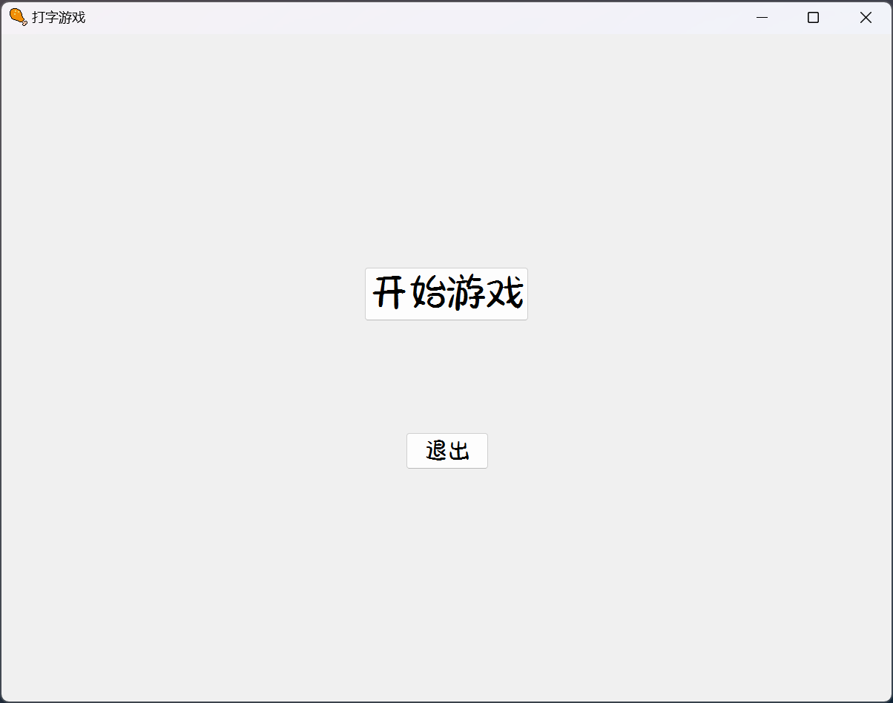
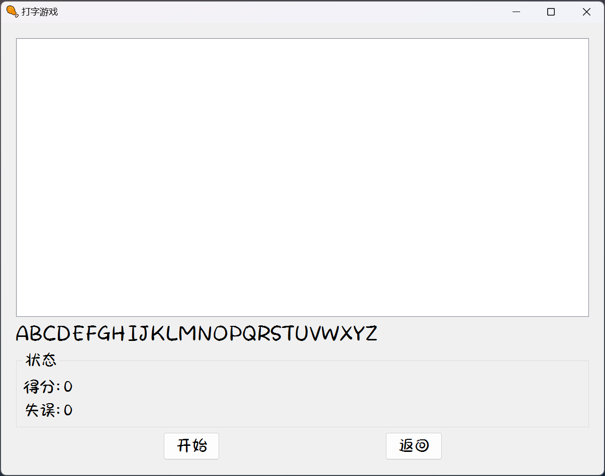

# 下载

1. 到[Release](https://github.com/ttiee/cpp-Work3/releases)下载打包好的`exe`文件

2. 下载源码，使用`Qt Creator`打开，编译运行(Qt版本`6.6.1`)
```bash
git clone https://github.com/ttiee/cpp-Work3.git
```

---

# 介绍

大一C语言大作业，一个简单的打字游戏。

> ~~(Qt Creator没license，开发不了了😵‍💫)~~
> 
> 等我Linux配置好Qt开发环境再说吧😴

## 项目结构

```bash
.
├── README.md               # 项目介绍
├── .gitignore              # .gitingore
├── main.cpp                # 主函数
├── widget.cpp              # 主窗口
├── widget.h                # 主窗口头文件
├── widget.ui               # 主窗口ui文件
├── CMakeLists.txt          # CMakeLists.txt
├── CMakeLists.txt.user     # CMakeLists.txt.user
├── img                     # 图片资源
│   ├── icon.png            # 图标
├── .github                 # github actions
│   ├── workflows       
│   │   ├── build.yml
|   |   └── windows.yml
└── doc-assets                  # README图片
```
## 游戏截图




